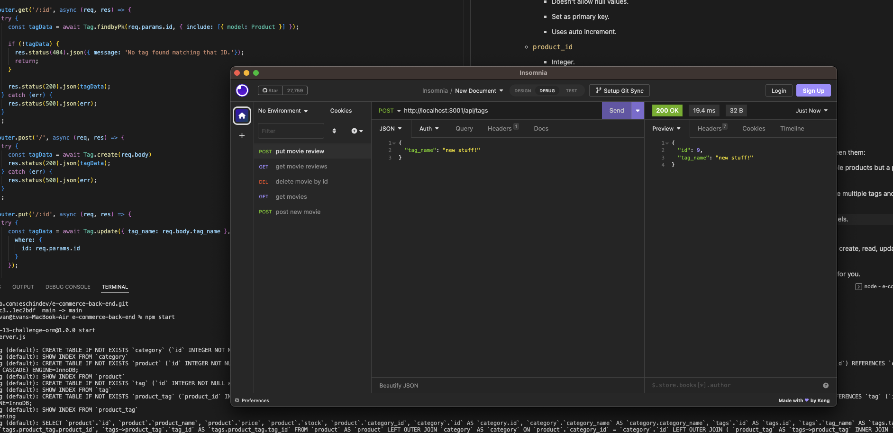

# E-Commerce Backend Database

[See it in action!](https://drive.google.com/file/d/1GO4vi1JTDDeSLRadS9O39gKFXZPs3D0E/view)

## Table of Contents
- [Description](#description)
- [Installation](#installation)
- [Usage](#usage)
- [Technologies](#technologies)
- [Questions](#questions)

## Description
An API and database to serve as a simple backend for an e-commerce website, allowing for CRUD operations to be performed on Products, Categories, and Tags.

## Installation
Clone the repo, cd into it, run "npm i" to install dependencies, use MySQL to run db/schema.sql to create the database, run "npm run seed" to seed the database, and run "npm start" to initialize the service.

## Usage
Use Insomnia or another API request tool to make custom requests to the API endpoints corresponding to those found in the "routes" folder. Alternatively, build a frontend platform that makes appropriate API calls to the service.

## Technologies
- Node.js
- Express.js
- MySQL2
- Sequelize

## Questions

[My GitHub Profile](https://github.com/eschindev)

[Email me!](mailto:eschindler1993@gmail.com)